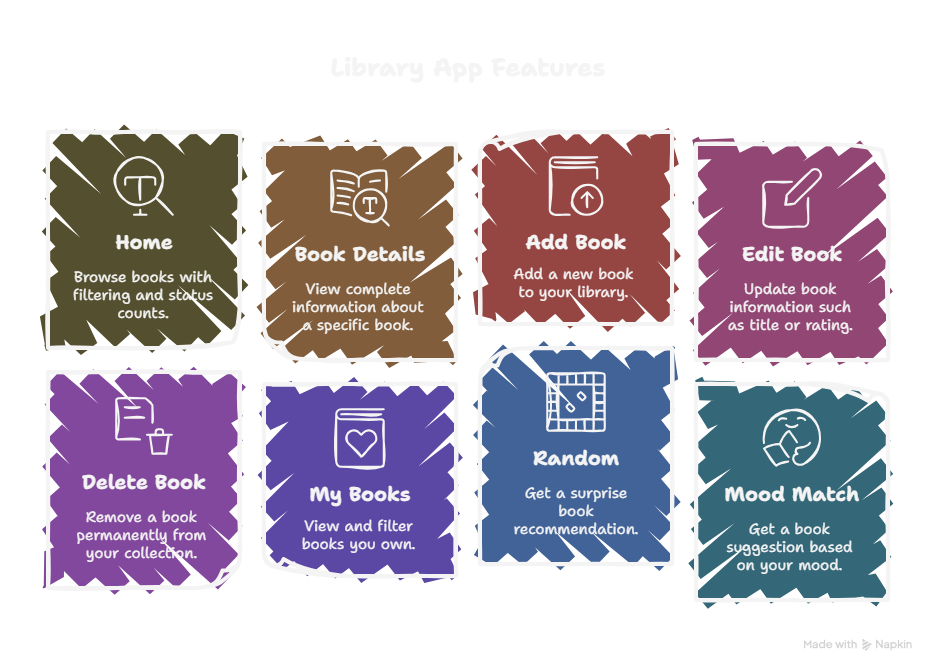
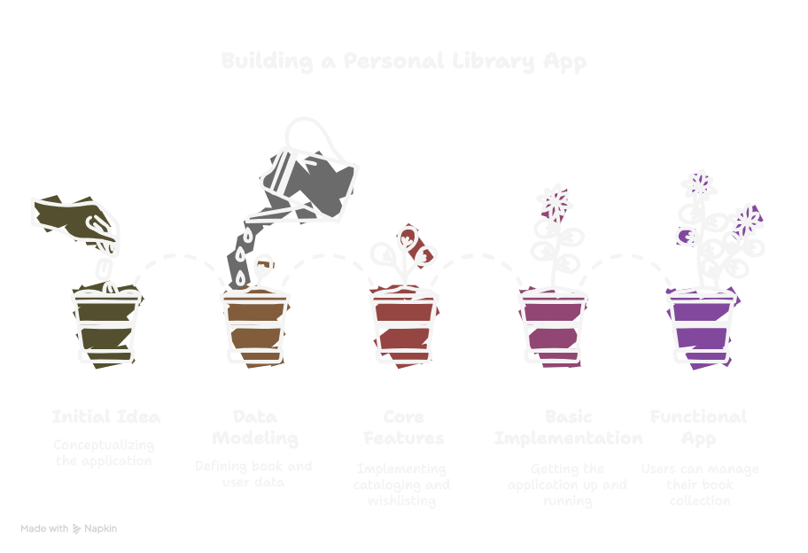

# Personal Library Application with Django

---

---
# Core Features
### The application should provide the following core features:
* Book Management:
    *  Add new books to the library.
    * Edit existing book information.
    * Delete books from the library.
    * Mark books as "owned" or "wanted."

* Book Information:
    * Store essential book details such as title, author, ISBN, publication date, and cover image.
    * Include a personal rating or review for owned books.
    * Add notes or comments about each book.

* Categorization and Filtering: 
    * Categorize books by genre, subject, or custom tags.
    * Filter books based on ownership status (owned, wanted), genre, author, or rating.

* Search Functionality:
    * Search for books by title, author, or ISBN.

* Wishlist Functionality:
    * Ability to add books to a wishlist.

* Reading Status:
    *Track reading progress (e.g., "Unread," "Currently Reading," "Completed," "Wishlist").
---

---
# Data Models
### The following Django models will be used to represent the data:

```
from django.db import models
from django.core.validators import MinValueValidator, MaxValueValidator
import os

def book_cover_path(instance, filename):
    """Generate upload path for book covers"""
    ext = filename.split('.')[-1]
    filename = f"{instance.isbn13 or instance.isbn10 or 'book'}_{instance.id}.{ext}"
    return os.path.join('covers', filename)

class Book(models.Model):
    # Basic Information
    title = models.CharField(max_length=500)
    authors = models.CharField(max_length=500, help_text="Separate multiple authors with commas")
    description = models.TextField(blank=True)
    
    # Publishing Information
    publisher = models.CharField(max_length=200, blank=True)
    publish_date = models.DateField(null=True, blank=True)
    
    # ISBN Information
    isbn13 = models.CharField(max_length=13, unique=True, null=True, blank=True)
    isbn10 = models.CharField(max_length=10, unique=True, null=True, blank=True)
    
    # Book Details
    pages = models.IntegerField(null=True, blank=True, validators=[MinValueValidator(1)])
    price = models.DecimalField(max_digits=10, decimal_places=2, null=True, blank=True)
    
    # Additional Information
    tags = models.CharField(max_length=500, blank=True, help_text="Separate tags with commas")
    cover_image = models.ImageField(upload_to=book_cover_path, blank=True, null=True)
    
    # Metadata
    date_added = models.DateTimeField(auto_now_add=True)
    last_modified = models.DateTimeField(auto_now=True)
    
    # Reading Status
    READING_STATUS = [
        ('unread', 'Unread'),
        ('reading', 'Currently Reading'),
        ('completed', 'Completed'),
        ('wishlist', 'Wishlist'),
    ]
    reading_status = models.CharField(max_length=20, choices=READING_STATUS, default='unread')
    
    # Rating
    rating = models.IntegerField(
        null=True, 
        blank=True, 
        validators=[MinValueValidator(1), MaxValueValidator(5)],
        help_text="Rate from 1 to 5 stars"
    )
    
    # Personal Notes
    notes = models.TextField(blank=True)
    
    class Meta:
        ordering = ['-date_added']
        
    def __str__(self):
        return self.title
    
    def get_authors_list(self):
        """Return authors as a list"""
        return [author.strip() for author in self.authors.split(',') if author.strip()]
    
    def get_tags_list(self):
        """Return tags as a list"""
        return [tag.strip() for tag in self.tags.split(',') if tag.strip()]
```

---
# Book Model Explanation

## **Book**
Represents a book in the library or user’s personal collection.

---

### **Basic Information**
- **title:** The title of the book.  
- **authors:** Names of authors (comma-separated if multiple).  
- **description:** Summary or overview of the book.  

---

### **Publishing Information**
- **publisher:** Name of the publisher.  
- **publish_date:** Date the book was published.  

---

### **ISBN Information**
- **isbn13:** 13-digit ISBN number, unique identifier for the book.  
- **isbn10:** 10-digit ISBN number, older format for book identification.  

---

### **Book Details**
- **pages:** Total number of pages in the book.  
- **price:** Cost of the book (stored as a decimal).  

---

### **Additional Information**
- **tags:** Keywords for categorizing books (comma-separated).  
- **cover_image:** Image file of the book’s cover, uploaded to the `covers/` folder.  

---

### **Metadata**
- **date_added:** Automatically stores when the book entry was created.  
- **last_modified:** Automatically updates when the book entry is edited.  

---

### **Reading Status**
- **reading_status:** Tracks reading progress.  
  Choices:  
  - `unread` → Unread  
  - `reading` → Currently Reading  
  - `completed` → Completed  
  - `wishlist` → Wishlist  

---

### **Rating**
- **rating:** User’s personal rating (1–5 stars).  

---

### **Notes**
- **notes:** Personal notes or comments about the book.  

---

## **Helper Methods**
- **get_authors_list():** Returns authors as a clean list.  
- **get_tags_list():** Returns tags as a clean list.  

---

## **Utility Function**
- **book_cover_path(instance, filename):**  
  Generates a unique upload path for book covers, naming the file using the book’s ISBN or ID and storing it under the `covers/` directory.

---
# Implementation Strategy

## **Project Setup**

1. **Create a new Django project**
   ```
   django-admin startproject personal_library
   ```

2. **Create a new Django project**
    ```
    python manage.py startapp books
    ```

3. Add `books` to `INSTALLED_APPS` in `settings.py`.

4. Configure the database in `settings.py` (e.g., SQLite for development).

5. Configure static and media files in settings.py
Used for serving CSS, JavaScript, and images.

6. Include `MEDIA_ROOT` and `MEDIA_URL` in `settings.py`
Handles storage and display of book cover images.

## **Model Definition**

1. Define the Author, Genre, and Book models in `books/models.py` (as shown in your model code).

2. Run migrations to create the database tables:
```
python manage.py makemigrations
python manage.py migrate
```

## **Admin Interface**

1. Register the models in library/admin.py
This allows managing books, authors, and genres through the Django Admin interface.


## **User Authentication**
1. Currently its made only for personal use, so no user registration and login is there. But for future i might implement it if needed.

